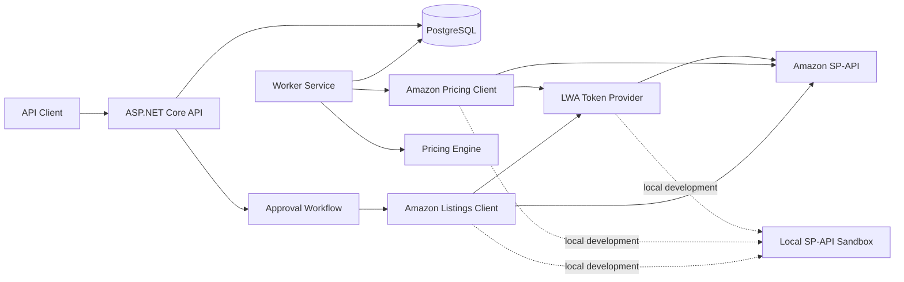
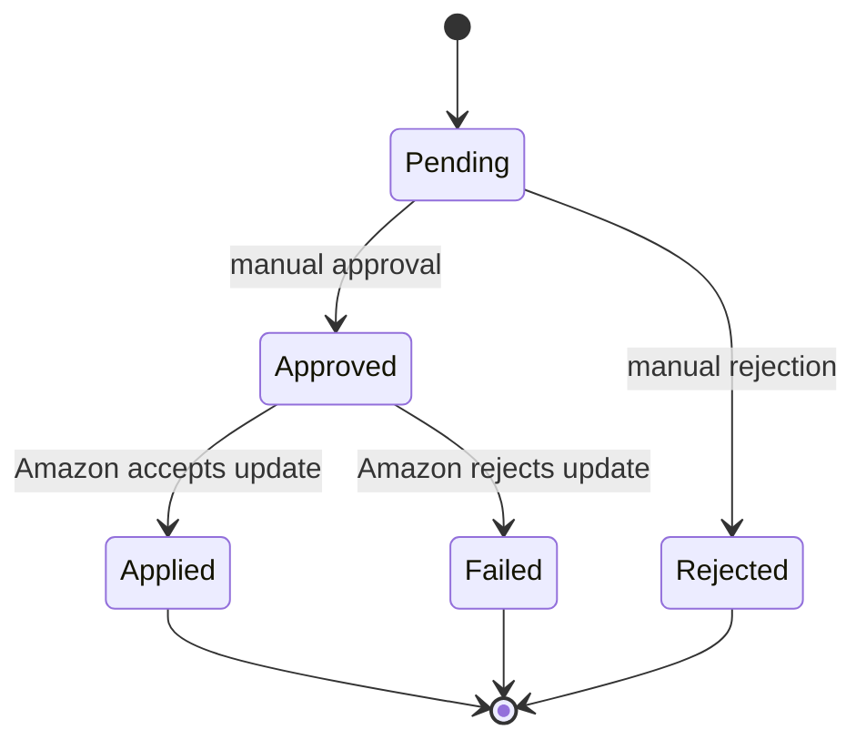

# Amazon Repricer

[](https://dotnet.microsoft.com/)
[](https://www.postgresql.org/)
[](https://www.docker.com/)
[](#testing)
[](#project-status)

A rule-based repricing backend for Amazon sellers, built with .NET 8, PostgreSQL, EF Core and background workers.

The system monitors competitive pricing data, evaluates pricing rules, creates auditable repricing decisions and applies approved prices through an Amazon SP-API-compatible Listings workflow.

> The Amazon integration is currently validated end-to-end against the included local SP-API Sandbox. Real seller credentials are not included in this repository.

## Why This Project Exists

Amazon sellers need to react to changing Featured Offer prices without losing control of profitability.

This project separates price calculation from price execution:

1. Competitive pricing data is collected.
2. The pricing engine calculates a proposed price.
3. Minimum price, maximum price and profitability rules are enforced.
4. A repricing event is created for review.
5. An approved event is submitted to the Listings API.
6. The product price and audit history are updated.

This design keeps automated pricing decisions observable and allows manual approval before a price reaches Amazon.

## Key Features

- Amazon marketplace participation connection test
- LWA access-token retrieval and application-wide token caching
- SP-API-compatible competitive pricing requests
- Featured Offer price evaluation
- Rule-based price calculation
- Minimum and maximum price boundaries
- Minimum profit protection
- Background repricing worker
- Retry and backoff configuration
- Duplicate price-snapshot prevention
- Duplicate repricing-decision prevention
- Manual approve/reject workflow
- Approved price application through the Listings API
- Stale-price protection before execution
- Applied and failed event tracking
- PostgreSQL audit history
- Local Amazon SP-API Sandbox
- Unit tests for pricing, authentication, Amazon clients and domain transitions

## Architecture



## Repricing Lifecycle



An event can only be applied when:

- Its status is `Approved`.
- The Amazon store is active.
- Repricing is enabled for the product.
- The product has a current price.
- The current product price still matches the event's original price.

The last rule prevents an approval based on stale pricing data from overwriting a newer price.

## Technology Stack

| Area | Technology |
|---|---|
| Runtime | .NET 8 |
| API | ASP.NET Core Web API |
| Background processing | .NET Worker Service |
| Persistence | Entity Framework Core |
| Database | PostgreSQL 16 |
| Amazon integration | Selling Partner API-compatible HTTP clients |
| Local integration testing | ASP.NET Core SP-API Sandbox |
| Infrastructure | Docker Compose |
| Testing | xUnit |

## Solution Structure

```text
AmazonRepricer.sln
├── src/
│   ├── AmazonRepricer.Api
│   │   └── HTTP endpoints and approval workflow
│   ├── AmazonRepricer.Application
│   │   └── Application abstractions and pricing contracts
│   ├── AmazonRepricer.Domain
│   │   └── Entities, enums and business rules
│   ├── AmazonRepricer.Infrastructure
│   │   └── EF Core, PostgreSQL and Amazon SP-API clients
│   ├── AmazonRepricer.Worker
│   │   └── Periodic pricing evaluation
│   └── AmazonRepricer.Sandbox
│       └── Local LWA, Pricing and Listings API simulation
└── tests/
    └── AmazonRepricer.Tests
```

## Local Development

### Prerequisites

- .NET SDK 8
- Docker and Docker Compose
- Git
- curl and Python 3 for the example terminal commands

### 1. Clone the repository

```bash
git clone https://github.com/lvntbk/amazon-repricer.git
cd amazon-repricer
```

### 2. Create the local environment file

```bash
cp .env.example .env
```

The `.env` file is ignored by Git. Do not commit real database passwords or Amazon credentials.

### 3. Start PostgreSQL

```bash
docker compose up -d
docker compose ps
```

PostgreSQL is exposed on port `5433` by default.

### 4. Apply database migrations

```bash
set -a
source .env
set +a

dotnet ef database update \
  --project src/AmazonRepricer.Infrastructure \
  --startup-project src/AmazonRepricer.Api
```

### 5. Start the Local Amazon Sandbox

Open a terminal:

```bash
DOTNET_ENVIRONMENT=Development \
dotnet run \
  --project src/AmazonRepricer.Sandbox \
  --urls http://localhost:5099
```

The Sandbox provides local equivalents for:

- LWA token generation
- Marketplace participation
- Competitive pricing
- Listings price updates

### 6. Start the API

Open another terminal:

```bash
set -a
source .env
set +a

DOTNET_ENVIRONMENT=Development \
dotnet run \
  --project src/AmazonRepricer.Api \
  --urls http://localhost:5066
```

Swagger is available in Development mode:

```text
http://localhost:5066/swagger
```

### 7. Start the Worker

Open another terminal:

```bash
set -a
source .env
set +a

DOTNET_ENVIRONMENT=Development \
dotnet run \
  --project src/AmazonRepricer.Worker
```

## Main API Endpoints

| Method | Endpoint | Description |
|---|---|---|
| `GET` | `/api/amazon/connection-test` | Tests marketplace participation |
| `GET` | `/api/amazon/pricing` | Reads competitive pricing |
| `GET` | `/api/amazon-stores` | Lists registered Amazon stores |
| `POST` | `/api/amazon-stores` | Registers an Amazon store |
| `GET` | `/api/products` | Lists products |
| `POST` | `/api/products` | Creates a product |
| `GET` | `/api/pricing-rules/{productId}` | Reads a product pricing rule |
| `POST` | `/api/pricing-rules` | Creates and activates a pricing rule |
| `POST` | `/api/repricing/evaluate` | Evaluates a price manually |
| `GET` | `/api/repricing-events` | Lists repricing events |
| `POST` | `/api/repricing-events/{id}/approve` | Approves a pending event |
| `POST` | `/api/repricing-events/{id}/reject` | Rejects a pending event |
| `POST` | `/api/repricing-events/{id}/apply` | Applies an approved price |

## Example Apply Flow

List approved events:

```bash
curl --fail-with-body -sS \
  "http://localhost:5066/api/repricing-events?status=Approved"
```

Apply an approved event:

```bash
curl --fail-with-body -sS \
  -X POST \
  "http://localhost:5066/api/repricing-events/{eventId}/apply"
```

Successful response:

```json
{
  "eventId": "70cbd26d-baac-4f44-8731-de3990ea5dad",
  "productId": "361cf048-4c61-4e79-a4b6-b71c2177d549",
  "sku": "TEST-SKU-001",
  "oldPrice": 1100.00,
  "newPrice": 1098.90,
  "status": "Applied",
  "submissionId": "sandbox-submission-id",
  "processedAtUtc": "2026-08-21T14:39:12Z"
}
```

A second apply attempt returns `409 Conflict`, preventing the same event from being processed twice.

## Configuration

Configuration can be supplied through `appsettings` files or environment variables.

Important Amazon settings:

```text
AmazonSpApi__Environment
AmazonSpApi__Endpoint
AmazonSpApi__LwaEndpoint
AmazonSpApi__MarketplaceId
AmazonSpApi__SellerId
AmazonSpApi__DefaultProductType
AmazonSpApi__CurrencyCode
AmazonSpApi__ClientId
AmazonSpApi__ClientSecret
AmazonSpApi__RefreshToken
```

Never commit real Amazon credentials. Use environment variables, a secret manager or deployment-platform secrets.

## Testing

Run the full build and test suite:

```bash
dotnet build
dotnet test
```

Current result:

```text
Build succeeded.
0 Warning(s)
0 Error(s)

Failed: 0
Passed: 33
Skipped: 0
```

The tests currently cover:

- Pricing-engine rules and boundaries
- LWA token acquisition and caching
- Amazon Sellers client
- Competitive pricing response parsing
- Listings price-update requests
- Amazon rejection responses
- Repricing-event state transitions
- Invalid and duplicate operations

## Security and Reliability

The current implementation includes:

- Secrets excluded through `.gitignore`
- Access-token caching with expiration safety
- Input and configuration validation
- Capped external error bodies
- Stale-price protection
- Duplicate snapshot and decision prevention
- Explicit approval before price execution
- Restricted event state transitions

Before production use, the following controls are still required:

- Authentication and role-based authorization
- Secret-manager integration
- Request rate limiting
- Optimistic concurrency for apply operations
- Persistent Amazon submission tracking
- Idempotency keys
- Reconciliation after partial failures
- Structured observability and alerting

## Project Status

The project is an actively developed MVP.

Completed:

- Pricing engine
- PostgreSQL persistence
- Background repricing cycle
- LWA authentication foundation
- Competitive pricing integration
- Approval workflow
- Listings price-submission flow
- Local end-to-end SP-API Sandbox
- Automated test suite

The current Amazon flow has been validated against the local Sandbox. A controlled pilot with real seller credentials is planned before production automation.

## Roadmap

- [ ] Persist Amazon submission IDs and issues
- [ ] Add optimistic concurrency and idempotency
- [ ] Add submission reconciliation worker
- [ ] Add API authentication and authorization
- [ ] Add structured logs, metrics and health checks
- [ ] Add multi-store credential isolation
- [ ] Add dashboard for products, rules and approvals
- [ ] Run a controlled real-seller pilot
- [ ] Add deployment manifests and CI/CD hardening

## Disclaimer

This is an independent software project and is not affiliated with, endorsed by or sponsored by Amazon.

Amazon, Selling Partner API and related names may be trademarks of their respective owners. Users are responsible for complying with Amazon policies and applicable marketplace rules.

## Author

**Levent İnce**

- GitHub: [@lvntbk](https://github.com/lvntbk)
- LinkedIn: [levent-ince-091838266](https://www.linkedin.com/in/levent-ince-091838266/)
